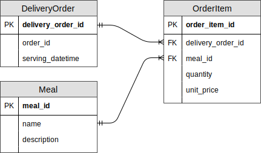

# README

# Setup

## Initialization

Create a new Rails project:

```
rails new ordoo --database=postgresql
```

## Workaround for `ffi (1.9.21)` installation error

```
An error occurred while installing ffi (1.9.21), and Bundler cannot continue.
```

This is a workaround. Add the following to `Gemfile`:

```
gem 'ffi', '1.9.18'
```

Then run:

```
bundle install
```

## Create `.gitignore` before pushing to remote repository

Update `.gitignore` to push only necessary files to Github.

## Push to remote repository

Create a new repository on Github. Then, run the following commands in project directory:

```
git add .
git commit -am "initial setup"
git remote add origin <INSERT YOUR REMOTE REPOSITORY URL>
git push -u origin master
```

## Generating models

Generate the models in the following order:

```
rails g model DeliveryOrder order_id:string serving_datetime:datetime
rails g model Meal name:string description:string
rails g model OrderItem delivery_order:references meal:references quantity:integer unit_price:integer
```

## Update associations in models



For `DeliveryOrder`, allow `order_id` to be stored as `null` even though it is validated for `uniqueness`.

```
validates :order_id, uniqueness: true, allow_nil: true
```

As there is no `id` before `DeliveryOrder.create()`, this allows the `order_id` to be created from `id` after it has been saved.

## Create database and run migrations

```
rails db:create
rails db:migrate
```

## Seed the database

Make sure the database has no active session before running the following command as the database will first be dropped before seeding.

```
rails db:seed
```

<!--
This README would normally document whatever steps are necessary to get the
application up and running.

Things you may want to cover:

* Ruby version

* System dependencies

* Configuration

* Database creation

* Database initialization

* How to run the test suite

* Services (job queues, cache servers, search engines, etc.)

* Deployment instructions

* ...
-->
